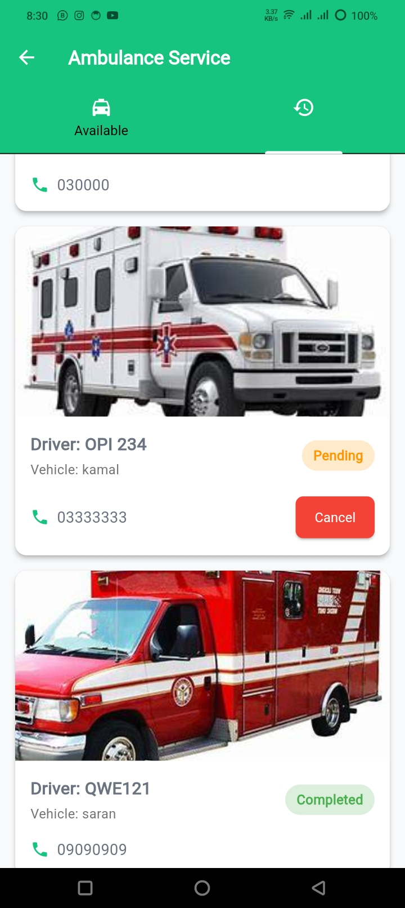

<div align="center">
  <h1>
    <br/>
    Doctor Appointment & Ambulance Management System
  </h1>
  <h3>A Comprehensive Solution for Healthcare Management</h3>
</div>

<p align="center">
    <a href="https://github.com/jamalihassan0307/" target="_blank">
        
    </a>
    <a href="https://www.linkedin.com/in/jamalihassan0307/" target="_blank">
        
    </a>
</p>

## 📌 Overview

The Doctor Appointment & Ambulance Management System is a Flutter application designed to streamline healthcare services. This project allows users to book appointments with doctors, manage patient details, and efficiently handle ambulance services.

## 🚀 Tech Stack

- **Flutter**
- **Firebase** (for authentication and data storage)

## 🔑 Key Features

- ✅ **User Authentication**: Secure login for admins, doctors, and patients.
- ✅ **Doctor Appointment System**: Book and manage appointments with doctors.
- ✅ **Ambulance Management**: View and manage ambulance statuses.
- ✅ **Booking System**: Easy booking of ambulances with real-time updates.
- ✅ **User Profiles**: Manage user information and preferences.

## 📸 Screenshots

### Banner


<table border="1">
  <tr>
    <td align="center">
      
      <p><b>Admin Dashboard</b></p>
    </td>
    <td align="center">
      
      <p><b>Admin Ambulance Management</b></p>
    </td>
    <td align="center">
      
      <p><b>Admin Ambulance Management 1</b></p>
    </td>
  </tr>
  <tr>
    <td align="center">
      
      <p><b>Admin Ambulance Management 2</b></p>
    </td>
    <td align="center">
      
      <p><b>View Patient Details</b></p>
    </td>
    <td align="center">
      
      <p><b>Ambulance States</b></p>
    </td>
  </tr>
  <tr>
    <td align="center">
      
      <p><b>Booking Confirmation</b></p>
    </td>
    <td align="center">
      
      <p><b>Ambulance Page Without Login</b></p>
    </td>
    <td align="center">
      
      <p><b>Book Ambulance Service</b></p>
    </td>
  </tr>
  <tr>
    <td align="center">
      
      <p><b>Appointments View Selector</b></p>
    </td>
    <td align="center">
      
      <p><b>Appointments View</b></p>
    </td>
    <td align="center">
      
      <p><b>Central Booking</b></p>
    </td>
  </tr>
  <tr>
    <td align="center">
      
      <p><b>Create Doctor Account</b></p>
    </td>
    <td align="center">
      
      <p><b>Create Doctor Account 1</b></p>
    </td>
    <td align="center">
      
      <p><b>Create Doctor Account 2</b></p>
    </td>
  </tr>
  <tr>
    <td align="center">
      
      <p><b>Create Patient Account</b></p>
    </td>
    <td align="center">
      
      <p><b>Doctor Dashboard</b></p>
    </td>
    <td align="center">
      
      <p><b>Doctor Dashboard 1</b></p>
    </td>
  </tr>
  <tr>
    <td align="center">
      
      <p><b>Doctor Detail</b></p>
    </td>
    <td align="center">
      
      <p><b>Doctor Profile</b></p>
    </td>
    <td align="center">
      
      <p><b>Login</b></p>
    </td>
  </tr>
  <tr>
    <td align="center">
      
      <p><b>My Central Appointment</b></p>
    </td>
    <td align="center">
      
      <p><b>My Patients</b></p>
    </td>
    <td align="center">
      
      <p><b>Patient Ambulance My Booked</b></p>
    </td>
  </tr>
  <tr>
    <td align="center">
      
      <p><b>Patient Ambulance View</b></p>
    </td>
    <td align="center">
      
      <p><b>Patient Dashboard</b></p>
    </td>
    <td align="center">
      
      <p><b>Patient Dashboard 1</b></p>
    </td>
  </tr>
  <tr>
    <td align="center">
      
      <p><b>Patient Dashboard 2</b></p>
    </td>
    <td align="center">
      
      <p><b>Profile Photo Update</b></p>
    </td>
    <td align="center">
      
      <p><b>Profile</b></p>
    </td>
  </tr>
  <tr>
    <td align="center">
      
      <p><b>Schedule Appointment Doctor</b></p>
    </td>
    <td align="center">
      
      <p><b>Schedule Appointment Doctor 1</b></p>
    </td>
    <td align="center">
      
      <p><b>Schedule Appointment Doctor 2</b></p>
    </td>
  </tr>
  <tr>
    <td align="center">
      
      <p><b>Schedule Appointment Patient</b></p>
    </td>
    <td align="center">
      
      <p><b>Schedule Appointment Patient 1</b></p>
    </td>
    <td align="center">
      
      <p><b>Setting Doctor</b></p>
    </td>
  </tr>
  <tr>
    <td align="center">
      
      <p><b>Setting Page</b></p>
    </td>
    <td align="center">
      
      <p><b>Setting</b></p>
    </td>
    <td align="center">
      
      <p><b>Setting</b></p>
    </td>
  </tr>
</table>

## 📁 Project Structure

```
doctor_appointment_app/
├── android/ # Contains all Android-specific configurations and files
│   ├── app/ # The main application module
│   │   ├── build.gradle # Gradle build configuration for the app
│   │   └── ... # Other app-related files
│   ├── gradle/ # Gradle wrapper files
│   └── build.gradle # Top-level Gradle configuration
├── lib/ # Contains all Dart code for the application
│   ├── controller/ # Directory for controllers
│   ├── model/ # Directory for data models
│   ├── screens/ # Directory for different screens
│   └── main.dart # Entry point of the Flutter application
├── pubspec.yaml # Flutter package configuration file
└── README.md # Documentation for the project
```

## 👨‍💻 Developer

Developed by [Jam Ali Hassan](https://github.com/jamalihassan0307)

---

<p align="center">
  Made with ❤️ using Flutter and Firebase
</p>
    